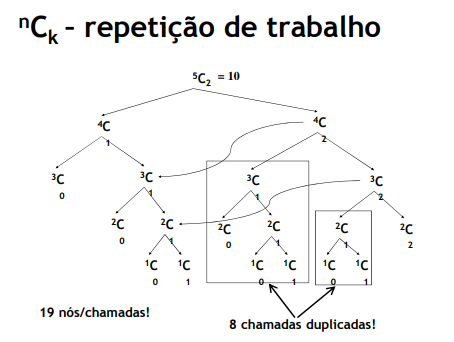
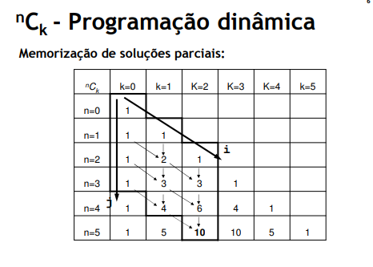
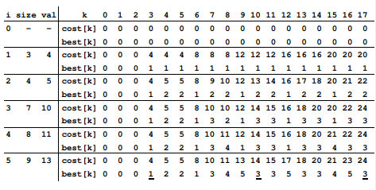

# Dynamic Programming

<br>

## Aplicability

 - Problems that can be solved using **recursion**
 - **Final Solution** is a **combination of similar sub-problems' solutions**
 - However, using plain recursion would mean **duplicate work** (same sub-problems would have the same solution)

## Aproach

 - **Save time**: avoiding duplicate work by memorising partial solutions of those sub-problems (using memory space)
 - **Save memory**: solving sub-problems in a way that minimizes the number of partial solutions to memorise (bottom-up)

## Top-down and Bottom-up

Strategies of **information processing** and knowledge ordering

### Top-down

**Breaking down of a system** to gain insight into its **compositional sub-systems** in a reverse engineering fashion. In a top-down approach an overview of the system is formulated, specifying, but not detailing, any first-level subsystems. Each subsystem is then refined in yet greater detail, sometimes in many additional subsystem levels, until the entire specification is reduced to base elements.

### Bottom-up

**Piecing together of systems** to give rise to more **complex systems**, thus making the original systems sub-systems of the emergent system

## Combinations

### Recursive

<br>

```C++
int comb(int n, int k) { // is executed 2*comb(n, k)-1 times
    if (k == 0 || k == n)
        return 1; // is executed comb(n, k) times
    else
    return comb(n-1, k) + comb(n-1, k-1); // is executed comb(n, k)-1 times
}
```

### Dynamic Programming

<br>

We can choose to either use a **column and work our way to the right**, or use a **row and work our way down**

```C++
#define MAXN = 50;

// Left column
static int c[MAXN+1];

int comb(int n, int k) {
    int maxj = n - k; // index of the final answer
    // fills the first column with 1's -> comb(1, 1)
    for (int j = 0; j <= maxj; j++)
        c[j] = 1; // n-k+1 times
    // changes the column by adding the previous value to the current one
    for (int i = 1; i <= k; i++)
        for (int j = 1; j <= maxj; j++)
            c[j] += c[j-1]; // k(n-k) times

    return c[maxj];
}
```

**Time Complexity**: T(n, k) = O(k(n-k))

**Space Complexity**: S(n, k) = O(n-k)) (Array size - maxj)

## Backpack Problem

### Strategy

 - Calculate the **best combination for all backpacks** with capacity 1 to capacity M
 - Start by considering that **we can only use item 1**, **then item 1 and 2 on the next iteration**, and so on **until N** (N = number of items)
 - Calculations are efficient in time and space if done in the correct order

### Data

 - **Input**
    - `N` - number of different items (unlimited number of copies per item)
    - `size[i]` (1<=i<=N) - size of item i
    - `val[i]` (1<=i<=N) - value of item i
    - `M` - backpack capacity
 - **Work Data in the end of each iteration** (0 to N)
    - `cost[k]` (1<=k<=M) - best value we can get with backpack of capacity `k`, using items from 1 to `i`
    - `best[k]` (1<=k<=M) – last item selected to get the best value with backpack of capcity `k`, using items from 1 to `i`
 - **Output**
    - `cost[M]` (1<=k<=M) - best value we can get with backpack of capacity M
    - `best[M]` (1<=k<=M) – last item selected to get the best value with backpack of capcity `k`, using items from 1 to `i`

<br>

```C++
int cost[M+1]; // intialized with 0's
int best[M+1]; // intialized with 0's

for (int i = 1; i <= N; i++ )
    for (int k = size[i]; k <= M; k++)
        if (val[i] + cost[k-size[i]] > cost[k]) {
            cost[k] = val[i] + cost[k-size[i]];
            best[k] = i;
        }

// Printing resulsts
std::cout << cost[M] << std::endl;
for (int k = M; k > 0; k -= size[best[k]])
    std::cout << best[k] << std::endl;
```

## References

Course Slides by R. Rossetti, Liliana Ferreira, Luís Teófilo

CAL, MIEIC, FEUP

February 2019