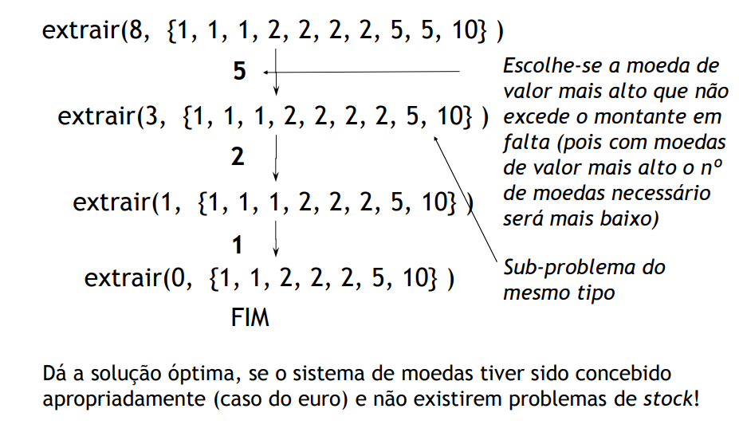
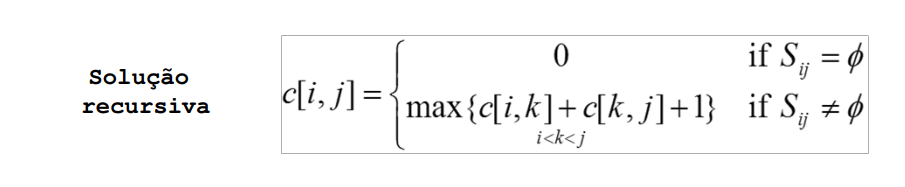
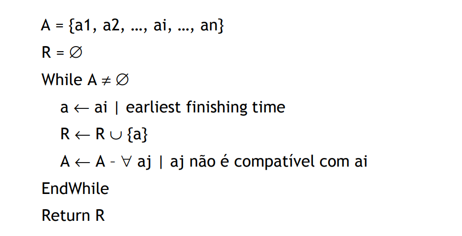
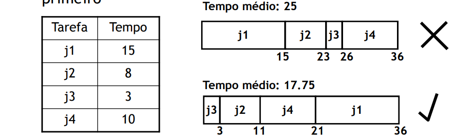

# Greedy Algorithms

 - Algorithm that finds an optimal local solution in every stage of the final solution
 - Aplicable to **optimization problems** (*maximization* or *minimization*)
 - In many problems, the **local optimization also garantees the global optimization**, making it possible to fin the optimal solution efficiently

 - **Optimal Substructure**: a problem has an optimal substructure if the problem's optimal solution contains optimal solutions for its subproblems.

## Greedy Strategy

 - A greddy algorithm works in steps. In each step we verify the following:
    1. We take the **best solution we can get in the exact moment**, without considering future consequences for the final solution.
    2. Since we chose the **optimal local solution in each step**, we hope to find the **optimal global solution** in the end

 - The option that appears to be the best solution in the moment is chosen:
    - When there is a choice to make, one of the possibilities is the greedy one. So it is always safe to opt for that one.
    - All the subproblems resulting from a greedy alternative are empty, except for the final result

## Premises

Five main characteristics back up the final solution:

 1. A **set of candidates**, where the solution is found
 2. A **selection function**, which chooses the best candidate to be included in the solution
 3. An **viabilty/feasibilty function**, which determines if the candidate can be part of the solution
 4. A **objective function**, that assigns a value to a solution, or a partial solution
 5. a **solution function**, which will determine if and when we have reached the complete solution of the problem

## Change Problem

**Probem**: Given the value of the change, find the optimal solution, in which the sum of all the coins values is equal to the value of the change with the least ammount of coins possible.

### Example

**Change**: 8

**Available Coins**: {1, 1, 1, 2, 2, 2, 2, 5, 5, 10}

**Solution**

<br>

Show me the code:
```C++
static const int coins[] = {1,2,5,10,20,50,100,200};

// stock[i] = number of coins with value coins[i]
int* select(int value, int stock[]) {
    int sel[coins.size]; // solution

    // We want highest value coins first, so we start in the end of coins[]
    for (int i = coins.size - 1; value > 0 && i >= 0; i--)
        // make sure there are coins available and the value is not higher than the remaining change
        if (stock[i] > 0 && coins[i] <= value) {
            int n_moed = Math.min(stock[i], value/coins[i]);
            sel[i] += n_moed;
            montante -= n_moed * moedas[i];
        }
    if (montante > 0) // there is no solution
        return null;
    else // we have found one
        return sel;
}
```

## Activity Scaling

 - **Problem**: Given a set of *activities*, find the best set with the highest number of non overlaping activities
 - **Input**: Set **S** consisting od *n* activites, {a1, a2, ... an}
    - si = ai start time
    - f1 = ai end time
 - **Output**: Subset A consisting of the maximum number of compatible activities (non overlaping)

**Optimal Substructure**:
 - We assume that the acitivies are ordered (f1 <= f2 <= ... <= fn)
 - Suppose that an **optimal solution** includes an acitivity ak
    - This generates 2 sub-problems
    - Select from a1 to ak-1, activities that compatible, and that end before ak
    - Select from ak+1 to an, activities that compatible, and that end after ak

**Recursive approach**
 - **Sij** = subset of activities in S that begin adter ai and end before aj starts
 - Subproblems: Select the maximum number of activities mutually compatible with Sij
 - c[i, j] = size of the subset with maximum amount of acitivities mutually compatible in Sij

<br>

**Greedy approach**
 - Consider the acitivities in a **specific order**
 - Choose the **"best option of activity"**
 - Discard all activities incompatible with the chosen activity
 - Possible strategies:
    - Earliest starting time - ascending in Si
    - Earliest finishing time - ascending in Fi
    - Shortest Interval - ascending in Fi - Si
    - Fewest conflicts - for each activity, count the number of conflicts e order by that number

<br>

```
A = {a1, a2, ..., an}
R = null
while A != null
    a = ai such that earliest finishing time
    R.add(a)
    A.remove(all aj such that aj overlaps ai)
EndWhile
Return R
```

**Other example**

 - **Data**: set of *jobs* that take a certain *time*
 - **Goal**: subset of jobs that minimize completion time
 - **Strategy**: shortest interval (end earlier than others)

<br>