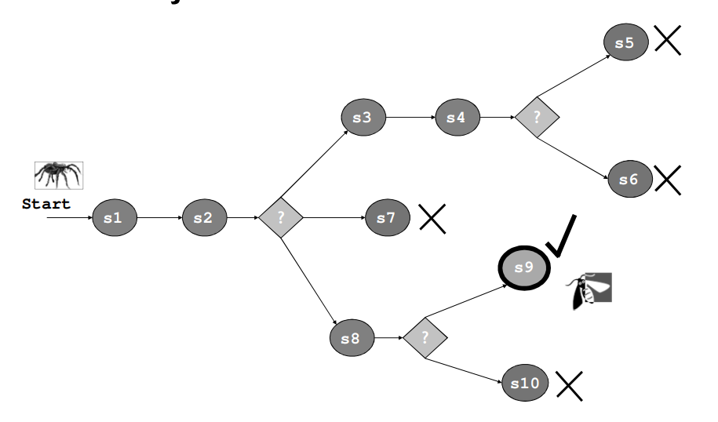
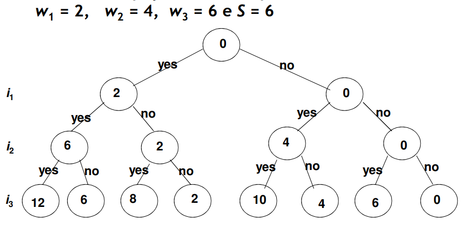

# Backtracking Algorithms

 - A certain problem has a set of **restrictions** and possibily a **objective function**
 - A **solution** optimizes or satisfies the **objective function**
 - We can represent the **set of solutions** using a state space tree
    - **Root**: 0 choices
    - **Level 1 leafs**: first choice
    - **Level 2 leafs**: second choice
    - ...
 - The **path** from the root to a leaf represents the solution


## Trial and error algorithms

 - General context of application:
    - Explore a *set of states* searching for a **objective-state**
    - **State**: game state, sub-problem to solve, position, etc...
    - Without efficient algorithms that lead directly to the solution
 - **Strategy**:
    - When arriving to the **time to make a choice** (leading to various other states), **choose one of the options** and **continue exploring**
    - Arriving to a **dead end**, backtrack until the state where we can make another choice
    - Repeat until a solution is found
 - **Example**:
    - **Change problem** when there is a lack of stock
    - Sudoku, labirinths, puzzles...

<br>

## Recursive Implementation

 - making a choice is corresponds to a **recursive call**
 - backtracking corresponds to a **recursive call's return**

```
function findGoal(Node N) {
    if (N is goal node/state)
        return "success"

    for each child node/state C of N {
        if (C is a possible choice)
            if (findGoal(C) == "success")
                return "success"
    }
    // no solution was found
    return "failure"
}
```
**OR**
```
Explore state/node N:

1. if N is a goal state/node, return “success”
2. (optional) if N is a leaf state/node, return “failure”
3. for each successor/child C of N,
    3.1. (if appropriate) set new state
    3.2. explore state/node C
    3.3. if exploration was successful, return “success”
    3.4 (if step 3.1 was performed) restore previous state
4. return “failure”
```

## Sum of Subsets

 - **Problem**: Given a subset of *n* positive integers {w1, ..., wn} and a positive integer *S*, find all subsets of {w1, ..., wn} in which the sum of its members is equal to S.
 - We can make a **binary tree** for each possible state:

<br>

 - The nodes contain the sum until then
 - Problems like this can be solved with a **depth-first search**
 - Each node stores its level (depth) and its solution (possibly partial)
 - a depth-first search can see if a node *v* is a leaf:
    - if *v* is a leaf, then we check if *v* **contains the solution**
    - we can find an optimal solution if we extend this method
 - a **strategy based purely on depth-first search** can be **quite costly in procesing time**
 - We can make this strategy more efficient if we check in **each node if it leads to a possible solution**

## Backtrack Strategy
 - A node is **"not promissing"** if it does not lead to a possible solution. Otherwise the node is **"promissing"**
 - Backtracking consists in doing a depth-first search in the state tree, checking if a node is promissing or not, if not backtrack to the node father

<br>

```C++
void checknode (Node v) {
    Node u;

    if (promissing(v)) { // checks if a solution is still possible given the current state
        if (aSolutionAt(v)) // checks if the solution given by the node is possbile
            writeSolution(v);
        else
            for (auto child : v.getChildren())
                checknode(child);
    }
}
```

 - When can a node be evaluated as **"promissing"**?
 - given a node at level `i`:
    - `weightSoFar()`: node's weight (sum of numbers included in the partial solution that the node represents)
    - `totalPossibleLeft()`: weight of items to come (from i + 1 to n)
    - A node is not promissing if:
        - `weightSofar()` + `totalPossibleLeft()` < `S`
        - `weightSofar()` + `w[i + 1]` > `S`
    - set of {w1, w2, ..., wn} needs to be in order

## Optimization problems

 - For optimization problems, we need to consider:
    - `best`: value of the best solution until then
    - `value(v)`: value of the solution in Node v
    - We need to modify `promissing(v)`
    - `best` is initialized with the value of the candidate solution or worse than ay possible solution
    - `best` is updated with `value(v)` if the solution in v is "better"
    - beeing "better" depends on the problem (maximization or minimization)

**Change Problem**

 - In case a **greedy algorithm** is unable to find a solution when in fact there is one, we might need to use this type of algorithm
 - **Answer**: backtracking until the **last time we made a choice and choosing another option** (removing the other option to not repeat the same problem) 

<br>

```C++
static const int coins[] = {1,2,5,10,20,50,100,200};

// stock[i] = number of coins with value coins[i]
int* select(int montante, int[] stock) {
    int sel[coins.size]; // solution
    return select(montante, stock, sel, moedas.size - 1) ? sel : null;
}

bool select(int mont, int stock[], int sel[], int maxIdx) {
    if (mont == 0)
        return true;

    for (int i = maxIdx; i >= 0; i--)
        if (stock[i] > sel[i] && moedas[i] <= mont) {
            sel[i]++;
            mont -= moedas[i];
            if (select(mont, stock, sel, i))
                return true;
            sel[i]--;
            mont += moedas[i];
        }
    return false;
}
```