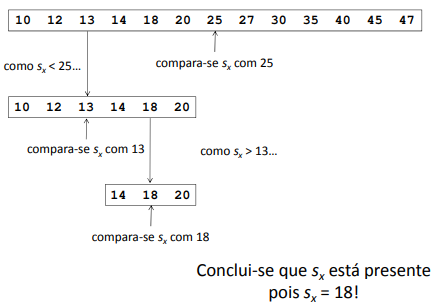

# Divide and Conquer

 - **Divide**: Recursively solve smaller problems
 - **Conquer**: Original problem's solution is composed of smaller problems' solutions
 - There is division when an **algorithm has at leat 2 recursive calls in its body**
 - sub-problems must be disjointed
    - if not, solve in a **bottom-up** fashion with **dynamic Programming**
 - Division in **sub-problems of similar dimension** is crucial for obtaining **good time efficiency**
 - Adequate for **parallel processing**

```
function DAQ(x)
    if x is small enough then
        solve x directly
    else
        divide x sub-problems: x1, …, xk
        
    for i := 1 to k do yi := DAQ( xi )
        y := Σ yi
    return y
```

## Examples

### Calculating x^n

```C++
double power(double x, int n) {
    if (n == 0)
        return 1;
    if (n == 1)
        return x;

    double p = power(x, n / 2);
    if (n % 2 == 0)
        return p * p;
    else
        return x * p * p;
} 
```

### MergeSort
 - Sort 2 subsets of equal dimension and merge them
 - **T(n) = O(n log n)**, worst or average case scenario
<br>
<br>
 - Let S = {s1, ..., sn} a set that we want to order. S != { } and s = {s}
 - **Divide**: remove all elements of S and put them on **two subsets**: S1 and S2, each one with about n/2 elements
 - **Conquer**: sort S1 and S2 using mergesort (recursion)
 - **Concatenation**: put all elements back in S, concatenating the ordered subsets S1 and S2, creating a unique ordered set

```
Merge-Sort(A, p, r)
    if p < r then
        q = (p+r) / 2
        Merge-Sort(A, p, q)
        Merge-Sort(A, q+1, r)
        Merge(A, p, q, r)

Merge(A, p, q, r)
    Take the smallest of the two topmost elements of
    sequences A[p..q] and A[q+1..r] and put into the
    resulting sequence. Repeat this, until both sequences
    are empty. Copy the resulting sequence into A[p..r]. 
```

<br>

**MergeSort in C++**

```C++
// Merges two subarrays of arr[]. 
// First subarray is arr[l..m] 
// Second subarray is arr[m+1..r] 
void merge(int arr[], int l, int m, int r) {
    int i, j, k; 
    int n1 = m - l + 1; 
    int n2 =  r - m; 
  
    int L[n1], R[n2]; /* create temp arrays */
  
    /* Copy data to temp arrays L[] and R[] */
    for (i = 0; i < n1; i++) 
        L[i] = arr[l + i]; 
    for (j = 0; j < n2; j++) 
        R[j] = arr[m + 1+ j]; 
  
    /* Merge the temp arrays back into arr[l..r]*/
    i = 0; // Initial index of first subarray 
    j = 0; // Initial index of second subarray 
    k = l; // Initial index of merged subarray 
    while (i < n1 && j < n2) {
        if (L[i] <= R[j]) {
            arr[k] = L[i]; 
            i++; 
        } 
        else {
            arr[k] = R[j]; 
            j++; 
        } 
        k++; 
    } 
  
    /* Copy the remaining elements of L[], if there are any */
    while (i < n1) {
        arr[k] = L[i]; 
        i++; 
        k++; 
    } 
  
    /* Copy the remaining elements of R[], if there are any */
    while (j < n2) {
        arr[k] = R[j]; 
        j++; 
        k++; 
    } 
} 
  
/* l is for left index and r is right index of the sub-array of arr to be sorted */
void mergeSort(int arr[], int l, int r) {
    if (l < r) {
        // Same as (l+r)/2, but avoids overflow for 
        // large l and h 
        int m = l+(r-l)/2; 
  
        // Sort first and second halves 
        mergeSort(arr, l, m); 
        mergeSort(arr, m+1, r); 
  
        merge(arr, l, m, r); 
    } 
} 
```

### Quickshort
 - Sort elements that are greater and smaller than the *pivot*, then concatenate 
 - **T(n) = O(n^2)** worst case scenario
 - **T(n) = O(n log n)** best and average case scenario

### Binary Search
 - Let **S** be an **ordered sequence of** *n* elements, and *sx* an element we wanto to search for
 - **Strategy**: Given the **set's middle element** *m*, we check if *sx* is equal to, greater or lesser than *m*
    - **Equal to**: return index
    - **Lesser**: repeat strategy with left part of set
    - **Greater**: repeat strategy with right part of set

<br>

**Pseudo-Code**
```
index location(index low, index high)
    index mid;
    if (low > high)
        return 0;
    else
        mid = [(low + high)/2];
        if (x == S[mid])
            return mid;
        else if (x < S[mid])
            return location(low, mid – 1);
        else
            return location(mid + 1, high);
```
**C++**
```C++
// C++ program to implement recursive Binary Search 
#include <iostream> 
using namespace std; 
  
// A recursive binary search function. It returns 
// location of x in given array arr[l..r] is present, 
// otherwise -1 
int binarySearch(int arr[], int l, int r, int x) {
    if (r >= l) {
        int mid = l + (r - l) / 2; 
  
        // If the element is present at the middle 
        // itself 
        if (arr[mid] == x) 
            return mid; 
  
        // If element is smaller than mid, then 
        // it can only be present in left subarray 
        if (arr[mid] > x) 
            return binarySearch(arr, l, mid - 1, x); 
  
        // Else the element can only be present 
        // in right subarray 
        return binarySearch(arr, mid + 1, r, x); 
    }
  
    // We reach here when element is not 
    // present in array 
    return -1; 
} 
  
int main(void) 
{ 
    int arr[] = { 2, 3, 4, 10, 40 }; 
    int x = 10; 
    int n = sizeof(arr) / sizeof(arr[0]); 
    int result = binarySearch(arr, 0, n - 1, x); 
    (result == -1) ? cout << "Element is not present in array"
                   : cout << "Element is present at index " << result; 
    return 0; 
}
```