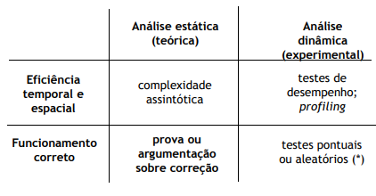

# Correctness

## Algorithm Analysis

<br>

## Specifications
 - To show that a certain algorithm correctly solves a problem, we need:
    - Rigorous specification of the problem
    - Rigorous description of the algorithm

 - Many problems can be specified by a pair:
    - **Input**: data input (preconditions)
    - **Output**: data output (Postconditions)

## Correction

 - **Partial Correction**: if an algorithm or program is executed with input data that obeys all preconditions, then, if it ends, its output data will be correct, i. e., that obeys all postconditions

 - **Total Correction**: if an algorithm or program is executed with input data that obeys all preconditions, then its output data must obey all postconditions

## Loop variations and invariations
 
 - Most algorithms are **iterative**, with a main loop
 - To prove that a cycle is correct we must find the **loop's invariation** - a boolean expression that is **always true** during the loop, and show that:
    - It is **true in the beginning** - **obeys to preconditions**
    - It is **true in each iteration**
    - When the loop is over, it must **obey to postconditions**
 - To show that a loop ends, we need to find its **variation** - a function

### Example - Insertion Sort

```
insertionSort(A, n)
    for j = 2 to n
        key = A[j]
        // insert A[j] into the sorted sequence A[1, ..., j-1]
        i = j - 1
        while i > 0 and A[i] > key
            A[i + 1] = A[i]
            i = i - 1
        A[i + 1] = key
```

**Invariation `I(j)`**

 - It is valid initially (`j = 2`)
    - It is obvious that `A[1, ..., 1]` contains the original elements, ordered
 - It is maintained in each iteration
    - We assume that the invariation is verified in the beginning of each iteration
    - The algorithm inserts `A[j]` in the correct position and increments `j`
    - So, in the end of each iteration (with the new `j`), we check the invariation
 - In the end of the loop (`j = n+1`), ensuring the postcondition
    - Invariation refers to A[1, ..., n] which means the whole array

**Variation `V(i)`**

`n + 1 - j` - ( `j = 2, ..., n+1` )
 - Integer, because `n` and `j` are integers
 - Not negative, because the max value of `j` is `n+1`
 - Decreasing, because `j` keeps getting incremented