# Graphs

## What is a graph

Graph `G = (V, E)`
 - `V` - set of vertices/nodes
 - `E` - set of edges
 - Each edge is a pair of vertices `(v, w)` that `c, w ∈ V`
 - if the pair is ordered then the graph is directed
 - a vertice `V` is adjacent to another vertice `W` if `(V, W) ∈ E`
 - in a non directed graph with an edge `(V, W)`, and obviously `(W, V)`, `W` is adejent to `V` and `V` is adjacent to  `W`

## Directed and not-directed graphs

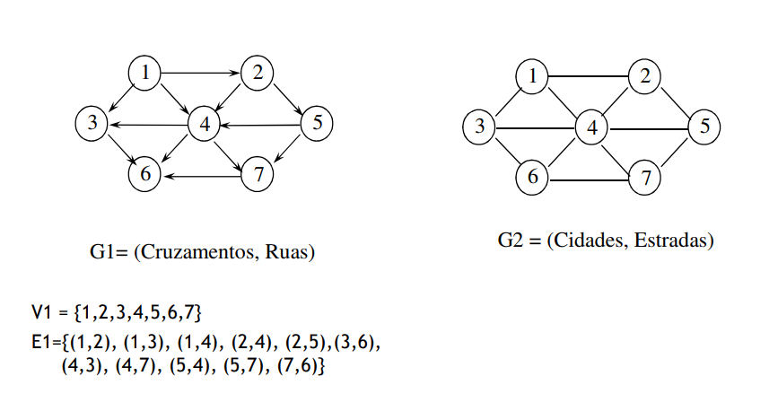<br>

## Routes

 - A **route** is a sequence of vertices `v1, v2, ..., vn` such that `(vi, vi+1) ∈ E, 1 <= i < n`
 - route **length** is equal to **number of edges**, n-1
 - if `n = 1`, route is just 1 vertice, so lenth equals 0
 - **simple route**: all distinct vertices, except possibly the first and the last

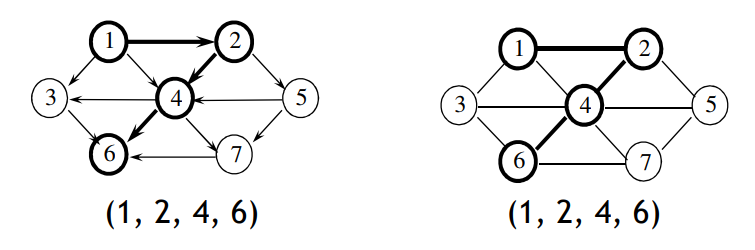<br>

## Loops

 - **Loop**: route with length >= 1 such that `v1 = vn`
 - in a **not-directed graph** the edges have to be distinct
 - **Ring**: route v, v such that `(v, v) ∈ E`, length = 1

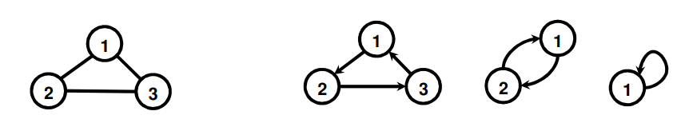<br>

## DAG - Directed acyclic graph

 - **directed graph** without loops
 - for each vertice `v`, there is **no connection starting and ending in v**

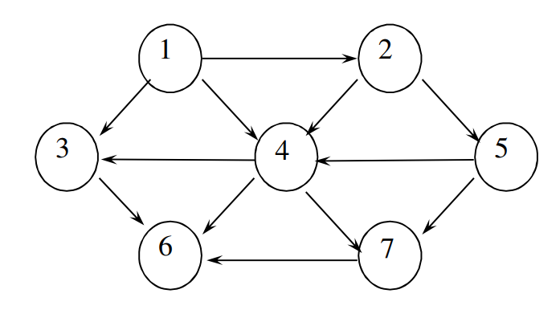<br>

## Weighted graphs

 - Its edges are **labeled** with their **weight**
 - weight can be representative of distance, cost, etc.

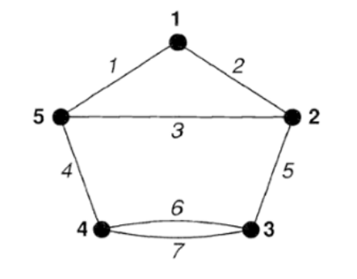<br>

## Split Graph

 - set of edges is split in 2 disjoint subsets `V1` and `V2`
 - edges connect vertices of different partitions

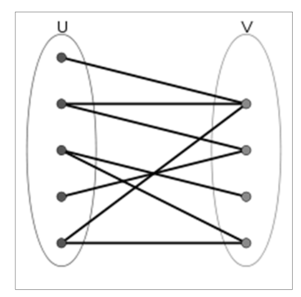<br>

## Connectivity

 - A graph is connected if **there is a route connecting each pair of vertices**

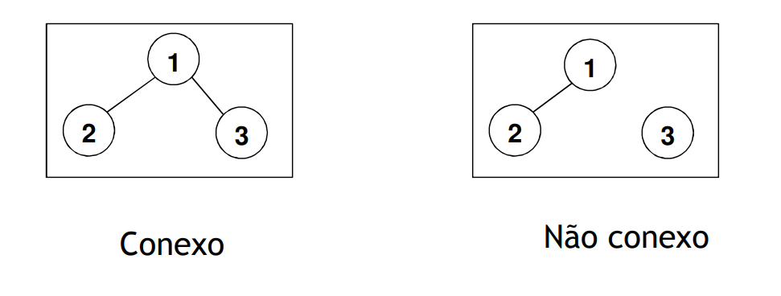<br>

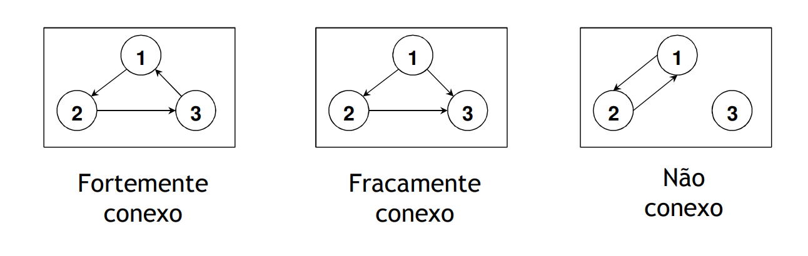<br>

## Density

 - **Dense graph**:  `|E| = Θ(V^2)`
    - **Complete graph**: there is an edge between any pair of vertices

 - **Sparse graph**: `|E| = Θ(V)`

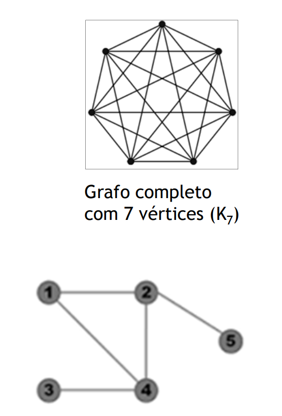<br>

## Application examples

 - **Transport Network**
    - Shortest path (GPS)
    - Traffic control and management
 - **Water supply network**
 - **Eletric grid**
 - **Computer network**
 - **Activity or job network**
    - Scaling problems
    - Project management problems
 - **Probabilty networks**
 - **Compilers**
 - **Games**
 - **Cryptography**

## Directed graphs representation

**Matrix A** of adjent nodes
 - `aij = 1` if `(i, j) ∈ E`
 - instead of 1, the **value can represent the weight**
 - good option for dense graphs

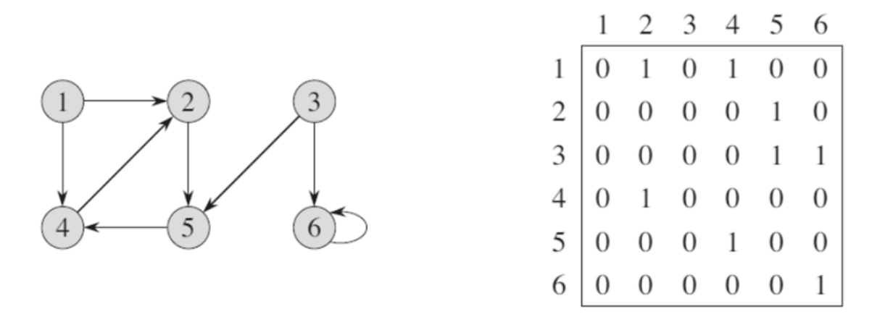<br>

**Adjacencies list**
 - for each vertice, we keep a list of adjacent vertices
 - `S() = O(|E| + |V|)`
 - adjacent search in proportional time of number of adjacent vertices
 - good for sparse graphs

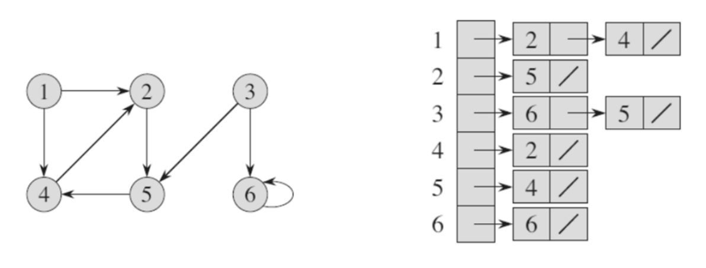<br>

## Not-directed graphs representation

 - list with double its space
 - simmetric matrix

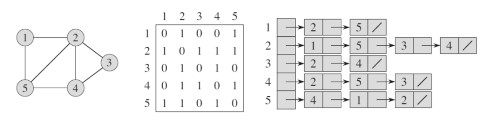<br>

**Show me the code**
```Java
class Graph {
    ArrayList<Vertex> vertexSet;
}

class Vertex {
    String name;
    LinkedList<Edge> adj; //arestas a sair do vértice
}

class Edge {
    Vertex dest;
    double weight;
}
```
