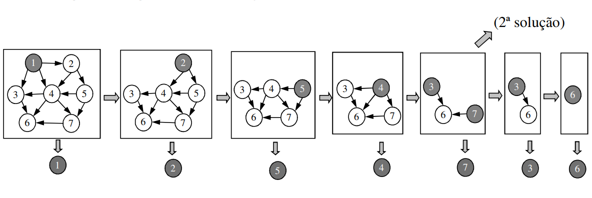

# Graph Algorithms - Search and Sort

## Depth-first search

 - Edges are explored starting in **the most recent found vertice `V`** even if it still has unexplored edges coming out of it
 - When all edges have been explored, **we go back the previous vertice that was connected to `V` and explored other edges**
 - If there are any unexplored vertices, one of them is selected as the new source to start the process from there
 - This process is repeated until all vertices have been explored

<br>

**Pseudo-code**
```
G = (V, E)
Adj(v) = {w | (v, w) ∈ E} (∀ v ∈ V)

DFS(G):
    for each v ∈ V
        visited(v) ← false
    for each v ∈ V
        if not visited(v)
            DFS-VISIT(G, v)

DFS-VISIT(G, v):
    visited(v) ← true
    pre-process(v)
    for each w ∈ Adj(v)
        if not visited(w)
            DFS-VISIT(G, w)
    post-process(v)
```

## breath-first search

 - Givena source vertice `s`, we systematically search the graph **finding all the vertices that can be accesed through `s`**
 - Only then do we pass on to the next vertice

<br>

**Step by step**

<br>

**Pseudo-code**
```
BFS(G, s):
    for each v ∈ V do discovered(v) ← false
    Q ← ∅
    
    ENQUEUE(Q, s)
    discovered(s) ← true

    while Q ≠ ∅ do
        v ← DEQUEUE(Q)
        pre-process(v)
        for each w ∈ Adj(v) do
            if not discovered(w) then
                ENQUEUE(Q, w)
                discovered(w) ← true
1       post-process(v)
```

**Some side notes**
 - For any vertice `v` that can be accessed through `s`, **the route in the BFS tree is the shortest path in the graph**
 - BFS is one of the most simple and most important methods for many complex algorithms
 - If instead of a `queue` we use a `stack`, we obtain an **iterative depth-first algorithm**

## Topological sort

### Problem
 - Sorting the vertices of a **DAG** (Directed acyclic graph) such that, if there is an edge `(v, w)` in the graph, then `v` comes before `w`
    - Intuively, dispse the arrows all in the same direction
    - Impossible if the graph is cyclical
    - There can be more than one way to order (solution)

<br>

### DFS based method

 - In a DAG DFS, the visit post-order gives us an inverse topological sort

<br>

 - This method is not generic, has it can't give us all possible toplogical sorts

### General Method

 1. Find a vertice **without any arrival edges - (indegree = 0)**
 2. Print that vertice
 3. Delete it and the edges coming out of it
 4. Repeat process for the remaining graph

<br>

## Topological sort algorithm

 - **General method refinement**:
    - **simulate the deletion** of a vertice by **updating the adjacent vertices' indegree value**
    - memorize in an **auxilar data structure** the vertices to print (with indegree = 0)
 - **Input Data**:
    - `V` - set of vertices
    - `adj(V)` - set (or list) of **adjecent vertices** for each vertice `V`
        - or set of **edjes that come out of `V`**, which point to adjacent vertices
 - **Output Data**:
    - `T` - sequence (or list) of **vertices in topological order**
        - or `numTop(V)` - number given to each vertice in topological order
 - **Temporary Data**:
    - `indegre(V)` - number of edges that arrive to `V`, from unexplored vertices
    - `C` - set of unexplored vertices whith indgree = 0 (candidates)

### Pseudo-code

```
TOP-SORT( in G=(V,E), out T):
    for each v ∈ V do
        indegree(v) ← 0

    for each v ∈ V do
        for each w ∈ adj(v) do
            indegree(w) ← indegree(w) + 1

    C ← { } // Pode ser uma fila (Queue), pilha (Stack), etc.

    for each v ∈ V do
        if indegree(v) = 0 then
            C ← C ∪ {v}

    T ← [ ] // Pode ser uma lista (LinkedList)
        
    while C ≠ {} do
        v ← remove-one(C)
        T ← T concatenado-com [v]
        for each w ∈ adj(v) do
            indegree(w) ← indegree(w) – 1
        if indegree(w) = 0 then
            C ← C ∪ {w}

    if |T| ≠ |V| then
        Fail(“O grafo tem ciclos”)
```
