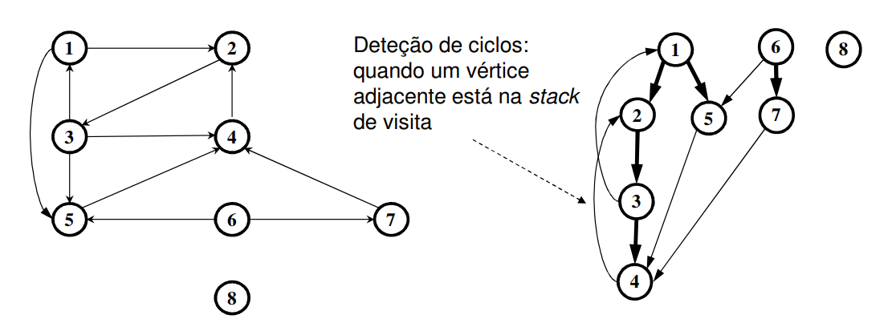
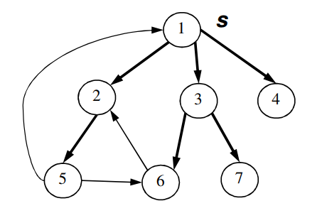
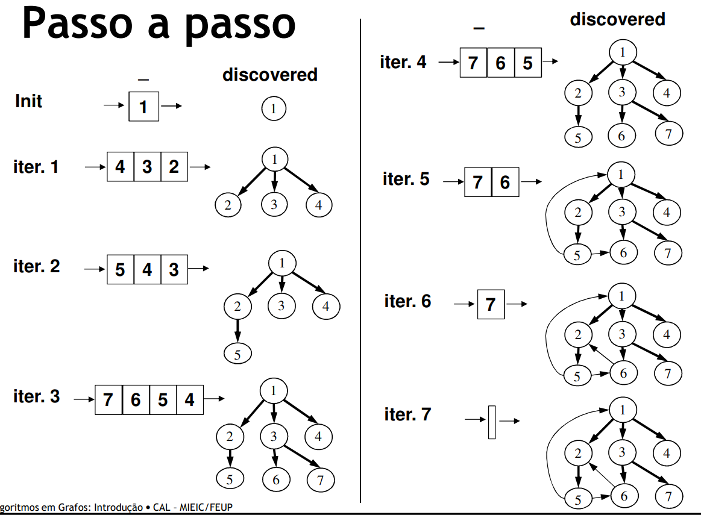
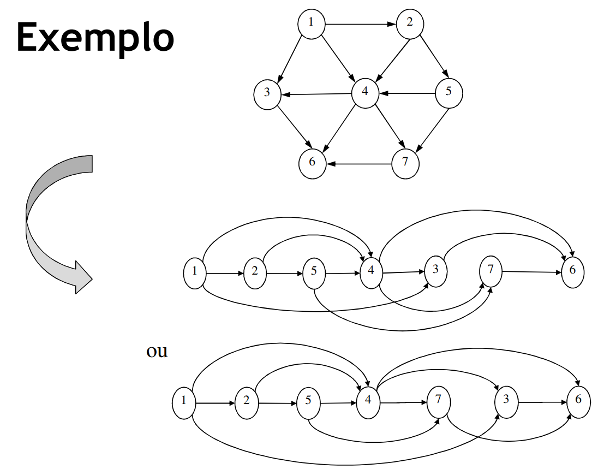

# Graph Algorithms - Search and Sort

## Depth-first search

 - Edges are explored starting in **the most recent found vertice `V`** even if it still has unexplored edges coming out of it
 - When all edges have been explored, **we go back the previous vertice that was connected to `V` and explored other edges**
 - If there are any unexplored vertices, one of them is selected as the new source to start the process from there
 - This process is repeated until all vertices have been explored

<br>

**Pseudo-code**
```
G = (V, E)
Adj(v) = {w | (v, w) ∈ E} (∀ v ∈ V)

DFS(G):
    for each v ∈ V
        visited(v) ← false
    for each v ∈ V
        if not visited(v)
            DFS-VISIT(G, v)

DFS-VISIT(G, v):
    visited(v) ← true
    pre-process(v)
    for each w ∈ Adj(v)
        if not visited(w)
            DFS-VISIT(G, w)
    post-process(v)
```

## breath-first search

 - Givena source vertice `s`, we systematically search the graph **finding all the vertices that can be accesed through `s`**
 - Only then do we pass on to the next vertice

<br>

**Step by step**

<br>

**Pseudo-code**
```
BFS(G, s):
    for each v ∈ V do discovered(v) ← false
    Q ← ∅
    
    ENQUEUE(Q, s)
    discovered(s) ← true

    while Q ≠ ∅ do
        v ← DEQUEUE(Q)
        pre-process(v)
        for each w ∈ Adj(v) do
            if not discovered(w) then
                ENQUEUE(Q, w)
                discovered(w) ← true
1       post-process(v)
```

**Some side notes**
 - For any vertice `v` that can be accessed through `s`, **the route in the BFS tree is the shortest path in the graph**
 - BFS is one of the most simple and most important methods for many complex algorithms
 - If instead of a `queue` we use a `stack`, we obtain an **iterative depth-first algorithm**

## Topological sort

**Problem**
 - Sorting the vertices of a **DAG** (Directed acyclic graph) such that, if there is an edge `(v, w)` in the graph, then `v` comes before `w`
    - Intuively, dispse the arrows all in the same direction
    - Impossible if the graph is cyclical
    - There can be more than one way to order (solution)

<br>