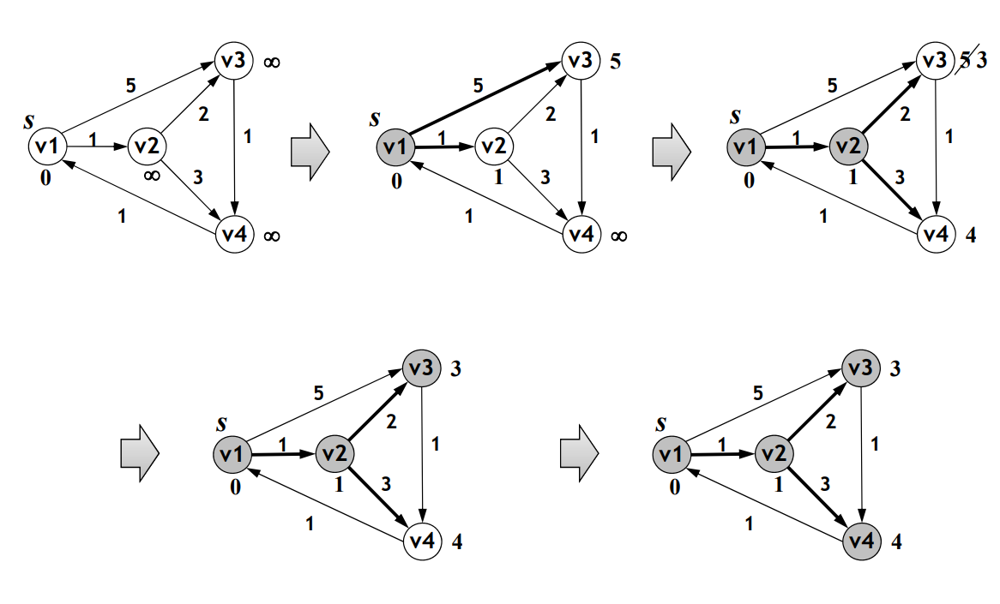

# Graph Algorithms - Shortest Path

# Shortest Path Between one vertice and all others

## Problem
 - Given a **weighted graph** `G = (V, E)` and a vertice `s`, we need to obtain the "shortest" path (minimal total weight) from `s` to **every other vertice** in `G`

<br>

## Variations
 - **Regular Case**: weigthed graph, stringly connected with weights >= 0
 - **Not-directed graph**
    - Same as with directed graph but with simetrical edges
 - **Not connected graph**:
    - There may not be a route to some vertices, giving us an infinite route
 - **Not weighted graph**:
    - Same as regular case with weights = 1 (shortest path = least ammount of edges)
 - **Edges with negative weight**_
    - There are less efficient algorithms for this case when compared to the regular case
    - Loops with negative weights make the shortest route undefined

## Applications

 - **Route planning**
 - **Overall planning problems**

## Not-weighted directed graph case

 - **Basic method**: (depth-first search + distance calculations)
    1. Make distance to vertice `s` equal to 0 and all others's equal to infinite
    2. Between all explored vertices (distance != infinite) and not processed in step 3, choose to process vertice `v` with the least distance
    3. Process vertice `v`: analize `adj(v)`, marking the ones not yet explored (distance = infinite) with distance v + 1
    4. Repeat process 2 and 3, if there are unexplored vertices

### Data Structures
 - Using a queue (FIFO) to insert the newly explored vertices and extract the next vertice to process (BFS), we can garentee the desired progression order
 - To each vertice we must have the following information:
    - **dist**: distance to the original vertice (`s`)
    - **path**: antecessor vertice in the shortest path

### Pseudo-Code

```
SHORTEST-PATH-UNWEIGHTED(G=(V,E), s):
    for each v ∈ V do
        dist(v) ← infinite
        path(v) ← nil
    dist(s) ← 0
    Q ← { }
    
    ENQUEUE(Q, s)
    while Q != { } do
        v ← DEQUEUE(Q)
        for each w ∈ Adj(v) do
            if dist(w) = infinite then
                ENQUEUE(Q, w)
                dist(w) ← dist(v) + 1
                path(w) ← v
```

<br>

## Weighted directed graph case

 - **Regular Method** similar to not-weighted method
 - Distance is obtained by adding edges's weights instead of 1
 - Next vertice to process still is the one with the least distance
    - But we no longer need the oldest one - use a **priority queue** (minimum distance in the head) instead of a regular queue
    - But it may be necessary to **revise the distance** of an **explored and unprocessed** vertice - use a **changeable priority queue**
    - The order is crucial to garentee that the distance from the staring vertice to the already processed vertices is no longer changed, assuming that there are no negative weights
 - Its a **greedy algorithm**: in each step we want to **minimze distance**

### Dijkstra Algorithm - Pseudo-Code

```
DIJKSTRA(G, s): // G=(V,E), s  V
    for each v ∈ V do
        dist(v) ← infinite
        path(v) ← nil
    dist(s) ← 0
    Q ← { } // min-priority queue

    INSERT(Q, (s, 0)) // inserts s with key 0
    while Q != { } do
        v ← EXTRACT-MIN(Q) // greedy
        for each w ∈ Adj(v) do
            if dist(w) > dist(v) + weight(v,w) then
                dist(w) ← dist(v)+ weight(v,w)
                path(w) ← v
                if w !∈ Q then // old dist(w) was infinite
                    INSERT(Q, (w, dist(w)))
                else
                    DECREASE-KEY(Q, (w, dist(w)))
```

<br>

### `DECREASE-KEY` efficiency

 - Imagine the `priority queue` implemented with a `heap` (array) with the minimum in its head and let `n` be the heap size (maximum is |V|)
 - **Naive Method**: *O(n)*
    1. Sequentially search the object array which key we want to change: O(n)
    2. Go up (or down) the object in the tree until we have reestablished the tree's invariation (each node lesser or equal then its children): O(log n)
 - **Updated Method**: *O(log n)*
    - Each object placed on the `heap` stores its position (index) in the array
    - So we no longer need step 1. making the total time O(log n)
    - It also introduces a bit of **overhead** in insertion and deletion operations (When an object is inserted/moved, its index has to be updated)
 - **Optimized Method**: *O(1)*
    - With **Fibonacci Heaps** we can do `DECREASE-KEY` in total time O(1)

### Dijkstra Algorithm Efficiency

 - **Execution time** is:
    - O( |V| + |E| + |V| * log|V| + |E| * log |V| ) **OR**
    - O( (|V| + |E|) * log|V| )
 - O( |V| * log|V| ) - insertion and extraction in `priority queue`
    - `|V|` - number of extractions
    - Each operation like this can be made in logarithmic time
 - O( |E| * log|V| ) - `DECREASE KEY`
    - Done max `|E|` times (once per edge)
    - Each operation like this can be made in logarithmic time
 - Can be optimized to O( |V| * log(V) ) with **Fibonacci Heaps**

## Negative Weighted directed graph case

 - In this case there may be the need to process each vertice more than once
 - If there are any loops with negative weight, **the problem has no solution**
 - The problem is solveable with total time O(|V| * |E|) using **Bellman-Ford Algorithm** 

<br>

### Pseudo-Code

```
BELLMAN-FORD(G, s): // G=(V,E), s  V
    for each v ∈ V do
        dist(v) ← infinite
        path(v) ← nil
    dist(s) ← 0
    for i = 1 to |V|-1 do
        for each (v, w) ∈ E do
            if dist(w) > dist(v) + weight(v,w) then
                dist(w) ← dist(v)+ weight(v,w)
                path(w) ← v
    for each (v, w) ∈ E do
        if dist(v) + weight(v,w) < dist(w) then
            fail("there are cycles of negative weight")
```

<br>

### Bellman-Ford Algorithm Analysis

 - In each iteration `i`, the algorithm processes all edges e guarantees that it finds all the shortest paths with up to `i` edges. (possibly even longer - main loop invariation)
 - Since the **longest possible no loop path** has |V|-1 edges, we only need to execute max |V| - 1 main loop iterations to ensure that all shortest paths are found
 - In the end we execute one more iteration to check if any distance can be even shorter. If that's the case, it means that there is a shorter path with |V| edges, which can happen only if we have at leat one negative weight loop
 - **Time Complexity**: O(|V| * |E|)

## DAG - Directed Acyclic Graphs

 - **Dijkstra Algorithm** simplified:
    - Process all vertices in **topological order**
    - Enough to verify that a processed vertice can no longer be changed, because there are no more 'new' edges
    - We can **combine** topological order with updating ditances and paths in a single swoop
    - **Execution Time** is the same as the topological order: *O(|V| + |E|)*

 - **Applications**
    - Irreversible Processes:
        - We can't go back to a certain state (Chemical reactions)
    - Product Management:
        - Project composed of activities with acyclical precedences

<br>

# Shortest Path Between 2 vertices

 - There is no known algorithm more efficient
