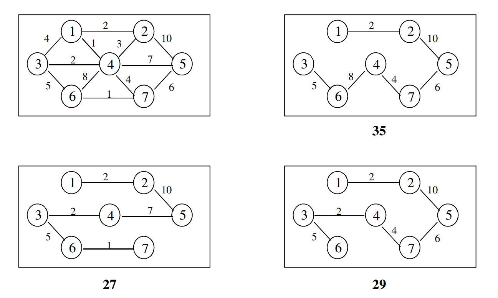
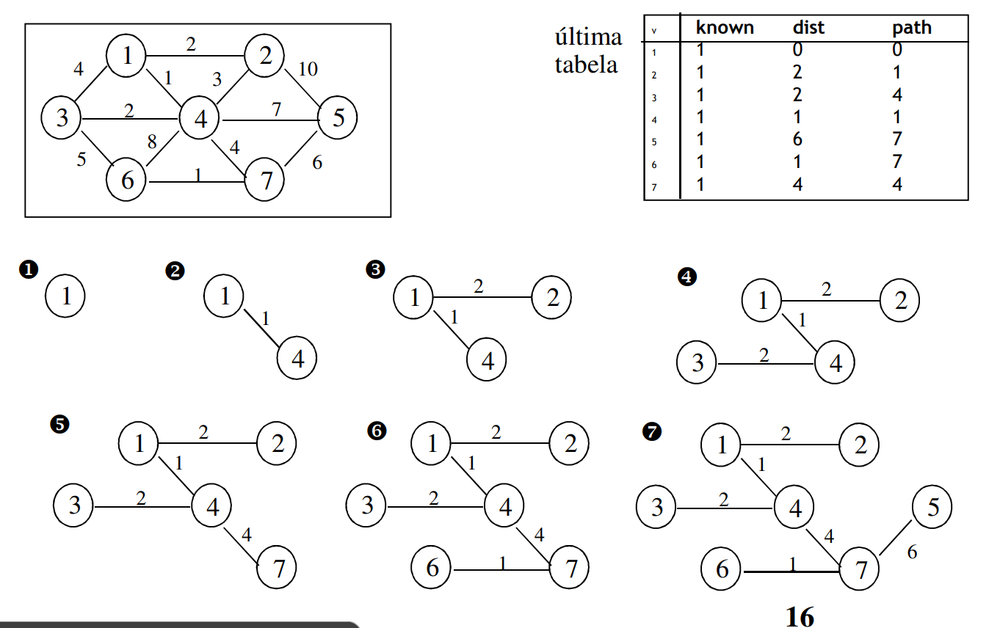

# Minimum Spanning Tree

Tree which **connects graph nodes** using **edges with minimum weight**.

 - **Not directed** graph
 - Graph has to be **connected**
 - tree -> connected acyclic graph
 - number of edges = `|V| - 1`

## Examples

 

## Prim's Algorithm

 - Expand tree by adding edges and according node
    - **Selection**: choose edge `(u, v)` of least weight such that `u` already belongs in the tree and `v` does not;
    - **Beggining**: Any node
 - Identical to Dijkstra's Algorithm
    - Node information:
        - `dist(v)` - least weight edge that connect to a vertice in the tree
        - `path(v)` - last vertice to change `dist(v)`
        - `known(v)` - `true` if vertice was precessed and belongs to the tree
    - After selecting a vertice `v`, for each not processed `w`, adjacent to `v` do `dist(w) = min {dist(w), cost(v, w)}`
    - Execution Time:
        - `O(|V|^2)` without priority queue
        - `O(|V| * log|V|)` with priority queue

 

## Kruskal's Algorithm

 - analize all edges from lighest to heaviest and **accept all that do not create cycles** (greedy) 
 - method:
    - **forest**: initially with one vertice in each tree
    - add an edge and merge two trees
    - when the algorithm ends we only get one tree
 -  Edge acceptande - Search/Merge Algorithm:
    - represented as trees
    - if two vertices
