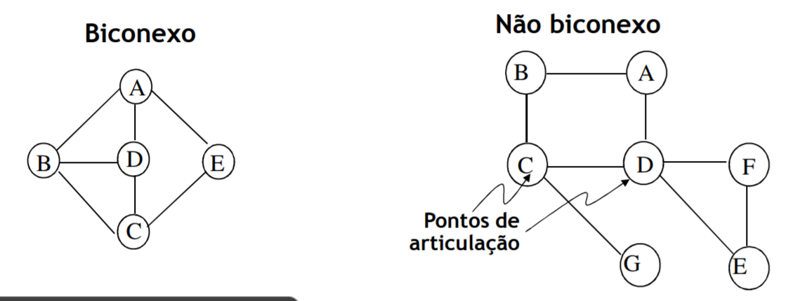
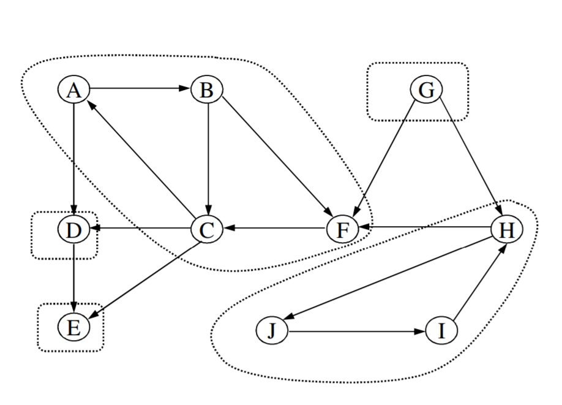
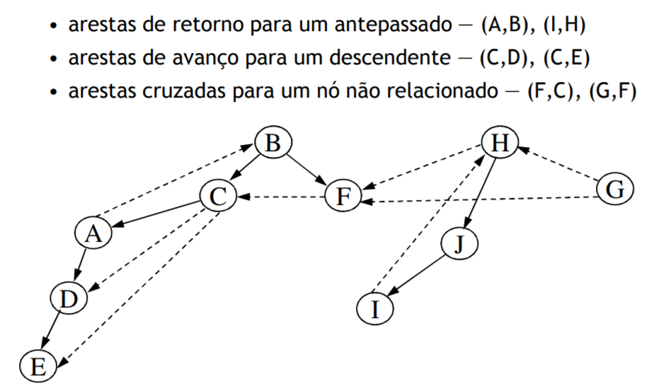

# Connectivity

## Non directed Graphs

 - A **non directed** graph is **conneted** if, by doing a **depth-first search** in each node we can get all other nodes.
 - A **non directed** graph is **biconnected** if there is no node that if removed make the graph disconnected
 - **Articulation points**: Nodes that make the graph disconnected

<br>

### Articulation point detection algorithm

 - Begins in any node
 - DFS, numerating nodes when visiting them: `num(v)`
 - For each node `n`, in the **DFS Tree**, calculate `low(v)`: the smallest node number that we can get to with zero or more edges and possibly a return edge
 - Node `n` is an articulation point if for one of its childs `w` we check that `low(w) >= num(v)`
 - The root is an articulation point if it has more than one child in the tree

**`low(v)` calculation**
 - `low(v)` is minimum of:
    - `num(v)`
    - the smallest `num(v)` of all return edges `(v, w)`
    - the smallest `low(v)` of all tree edges `(v, w)`
 - In the DFS, we initialize `low(v)` = `num(v)` before visiting adjacent nodes, and we keep updating the value of `low(v)` after each adjacent node visit
 - **Time**: `O(|E| + |V|)`

**Pseudo-code**

```
// Procura Pontos de Articulação usando dfs
// Contador global e inicializado a 1
void findArt( Vertex v) {
    v.visited = true;
    v.low = v.num = counter++;
    for each w adjacent to v
        if( !w.visited ) { // ramo da árvore
            w.parent = v;
            findArt(w);
            v.low = min(v.low, w.low);
            if(w.low >= v.num )
                System.out.println(v, "Ponto de articulação");
        }
    else
        if ( v.parent != w ) //aresta de retorno
            v.low = min(v.low, w.num);
}
```

## Directed Graphs

### Strongly connected components

<br>

**Method**
 - **DFS** of graph `G` determines spanning forrest, numerating nodes in post-order
 - Invert all edges of `G` (resulting graph - `Gr`)
 - Second **DFS** in `Gr`, starting always from the highest numbered node not yet visited
 - Each obtained tree is a strongly connected component, that is, from any node we can reach any other node

**Proof**
 - WHAT THE FUCK

### Spanning Trees

 - DFS induces an spanning tree/forrest
 - Besides geniune tree edges, there are edges for already marked nodes

<br>
