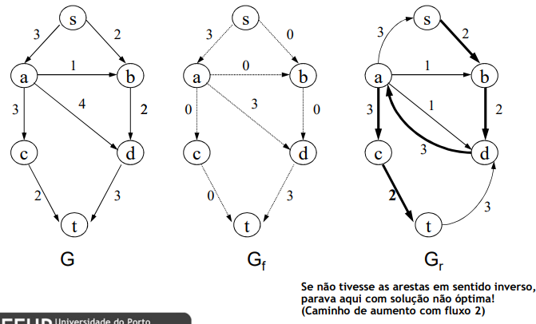

# Graph Algorithms: Maximum Flow in Transport Networks

## Transport Network

 - Model conervative flows between two nodes through limited capacity channels
     - **s:** source (producer)
     - **t:** well (consumer)
     - flow cannot be higher than the edge's capacity
     - **sum of input flows** in a node is **equal** to **sum of output flows**
 - Sometimes the edges have an associated cost (flow tranportation cost)

 

### Multiple sources and wells

 

## Maximum Flow Problem

Find the maximum flow vlaue from `s` to `t`.

## Ford-Fulkerson's Algorithm

### Data Structures

 - `G`: base graph with capacities `c(v, w)`
 - `Gf`: flow graph `f(w, v)`
     - initially all flows are equal to 0
     - in the end, we have the maximum flow
 - `Gr`: residue graph (auxiliar data structure)
     - for each arch `(v, w)` in `G` with `c(v, w)` -> `f(v, w)`, we create an arc with the same way in `Gr` with residue equal to `c(v, w)` - `f(v, w)`
     - for each arch `(v, w)` in `G` with `f(v, w)` -> 0, we create an arc with the opposite way in `Gr` with residue equal to `f(v, w)`

### Method

While there are ways from `s` to `t` in `Gr`:
 - Select any route in `Gr`, from `s` to `t`
 - Determine the minimum value (f) in the archs of that route
 - Increase that flow value (f) in each of the corresponding archs in `Gr`
 - Recalculate `Gr`

 

 

 

## Edmonds-Karp Algorithm

## Dinic Algorithm