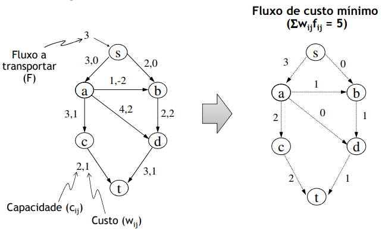

# Graph Algorithms: Minimum Flow Cost in Transport Networks

**Problem:** The goal is to transport a certain flow amount `F` (less or equal than the allowed by the network), from the source `s` to the well `t`, with minimum total cost.
 - Besides the capacity, edge's also have the **associated cost** to transport a single flow unit)
 - There can be edges with a negative cost

 

## Shortest Successive Path Method

 - **Greedy Algorithm:** with the Ford-Fulkerson Algorithm, we choose in each momment the shortest path (that is, **with the smallest cost**)
     - We stop when we hit a the intended flow, or when the are no more paths available
 - Restriction: Aplicable only in non cyclical networks with negative cost
     - Else, we must use a more generic algorithm (negative cycle cancelling)
     