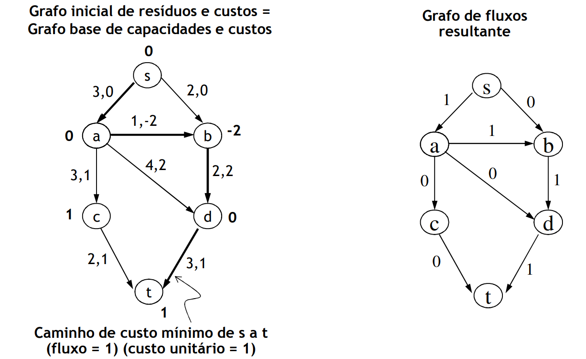
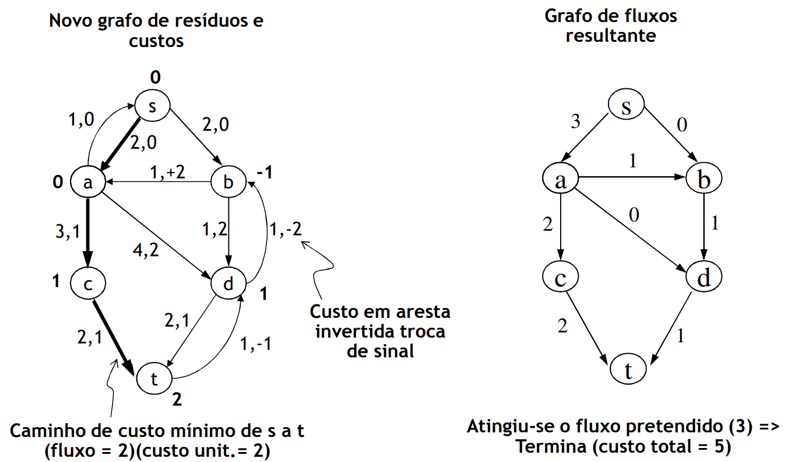
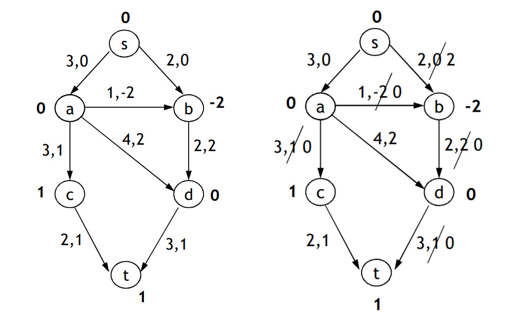
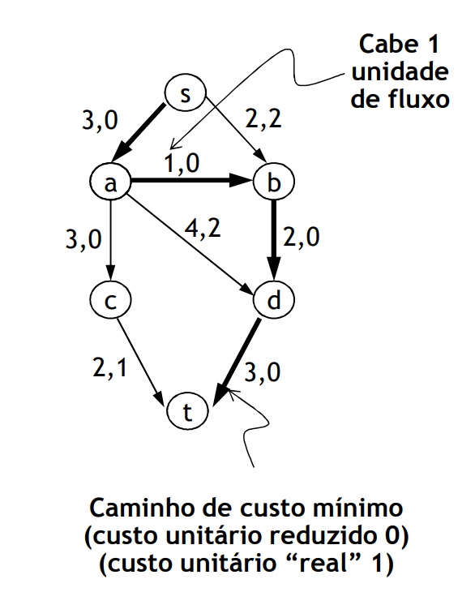
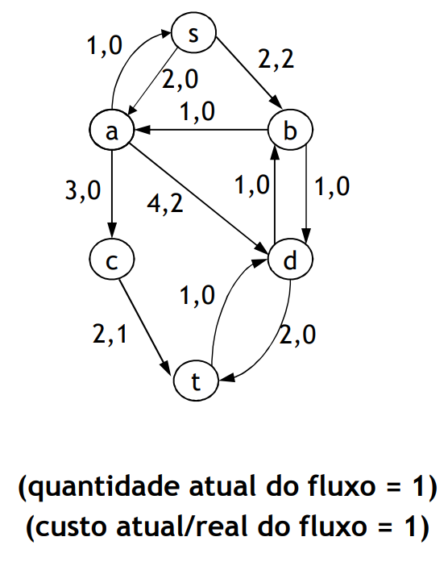
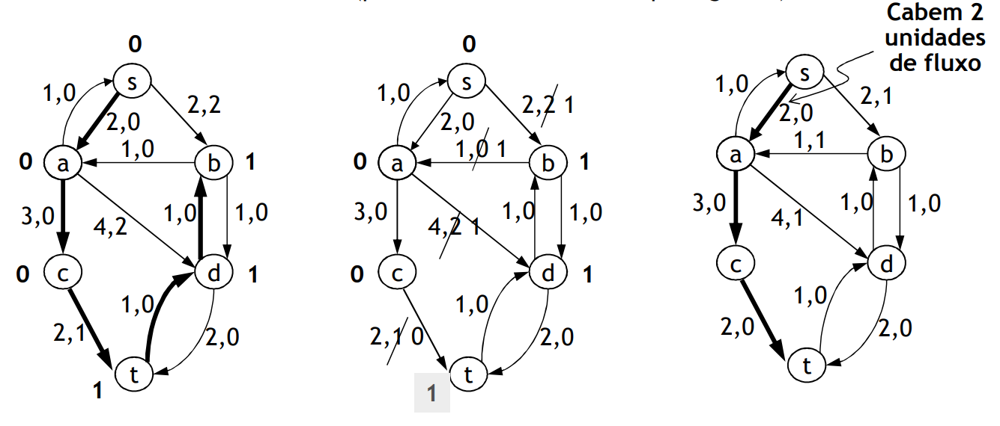
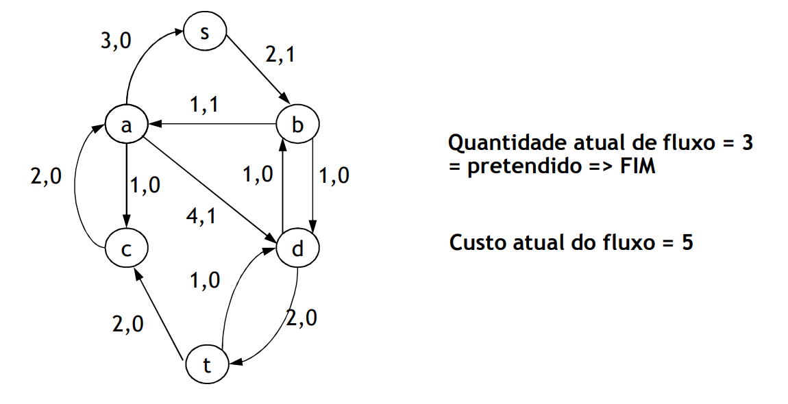

# Graph Algorithms: Minimum Flow Cost in Transport Networks

**Problem:** The goal is to transport a certain flow amount `F` (less or equal than the allowed by the network), from the source `s` to the well `t`, with minimum total cost.
 - Besides the capacity, edge's also have the **associated cost** to transport a single flow unit)
 - There can be edges with a negative cost

 

## Shortest Successive Augmented Path Method

 - **Greedy Algorithm:** with the Ford-Fulkerson Algorithm, we choose in each momment the shortest path (that is, **with the smallest cost**)
     - We stop when we hit a the intended flow, or when the are no more paths available
 - Restriction: Aplicable only in non cyclical networks with negative cost
     - Else, we must use a more generic algorithm (negative cycle cancelling)

 

 

 - **Difficulty:** Negative weight edges in the residue graph
     - Forces to use a least efficient algorithm (i.e *Bellman-Ford* - `O(|V| |E|)`)
 - **Solution:** We can convert the residue graph to an equivalent graph without negative weights
     - **1st iteration:** Use Bellman-Ford - `O(|V| |E|)`
     - **Remaining iterations:** Use Diskjstra - `O(|V| log|E|)`

### Residue Graph Conversion

1. In the first residue graph determine the shortest "distance" from `s` to all other nodes (`d(v)`)
2. Replace initial residues with the "reduced" costs: `w’(u,v) = w(u,v) + d(u) - d(v)`

 

### Determine the next augmented path

3. Select a shortest path from `s` to `t` in the residue graph

 

### Augmented Path Aplication

4. Apply augmented path:
     - Residue graph's inverted edge's weight is multiplied by `-1`
     - **BUT** `(-1) * 0 = 0`

 

### New Residue Graph Conversion

5. Since there are no more path with tota weight 0, we need to "reduce" the costs of the residue graph. I. e. recalculate shortest paths and reduce the costs

 

### Repeat the Process

6. Apply augmented path with cost 0
     - Update residue graph

 

### Efficiency

 - `F` - Max number of iterations (flow is incremented one unit)

**Total Time:** `O(F |E| log|V|)`
