# Graph Algorithms: Euler Circuits and Chinese Postman Problem

## Euler Circuits

 - **Euler Path:** Path that visits each node exactly one time
 - **Euler Circuit:** Euler Path that begins and ends in the same node

### Necessary Conditions

**Non-Directed Graph**
   - **Euler's Circuit**
      - connected
      - each node has an even degree (number of incident edges)
   - **Euler's Path**
      - connected
      - every node except 2 nodes (beoinginig and edn)

 

**Directed Graph**
   - **Euler's Circuit**
      - (strongly) connected
      - each node has the same degree of inputs and outputs
   - **Euler's Path**
      - (strongly) connected
      - every node except 2 has the same degree of inputs and outputs, and these 2 nodes inputs and ouputs differ by 1

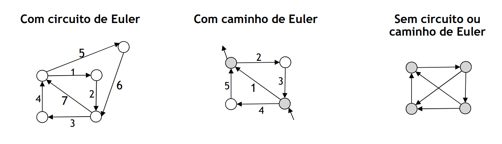 

### Finding Euler Circuits with DFS

1. Choose a node and perform a **depth-first search**
   - When visiting a node, if the node has **unvisited incoming edges**, choose one of those, mark it has visited and visit adjacent node
   - If the graph is an Euler Circuit, the search ends in the starting node
2. While there are edges to visit
   - Search (in the path) for the **first node with unvisited edges**
   - Do a sub-search (DFS) in that node **without going through already visited nodes**
   - Insert the result in the path

**Execution Time:** `O(|V| + |E|)`

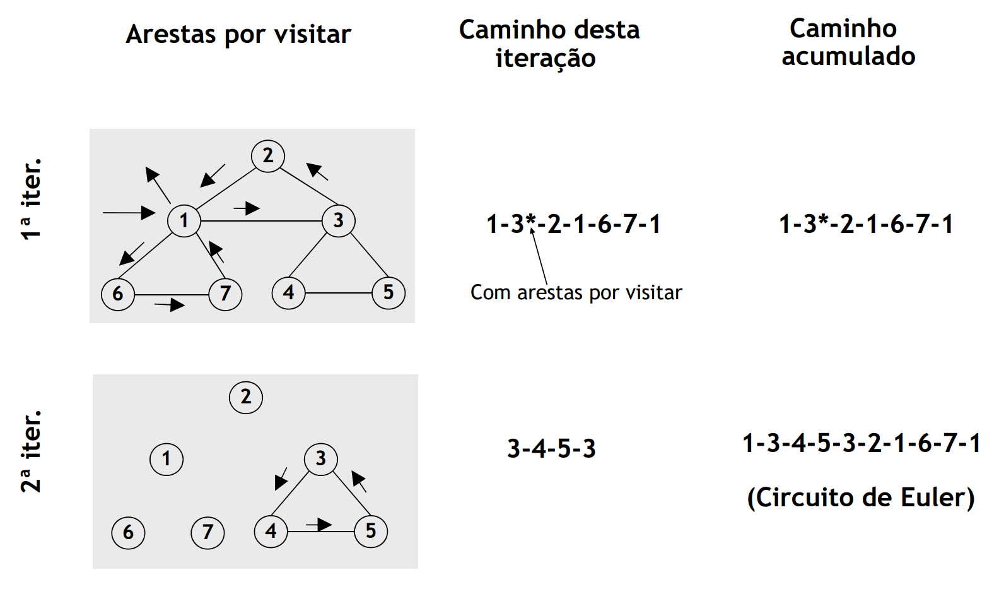 

## Chinese Postman Problem

Given a **weighted connected graph** `G = (V, E)`, we need to an **optimal path** (minimum weight) that **begins and ends in the same node** (closed path) and **goes through all edges of `G`** at least once

 - If `G` is Eulerian, the solution is simple: **every Euler Circuit is optimal Chinese Postman Solution**
 - If `G` is not Eulerian, we can build a new graph `G*` by duplicating some edges of `G`, such that `G*` is Eulerian with total minimum weight

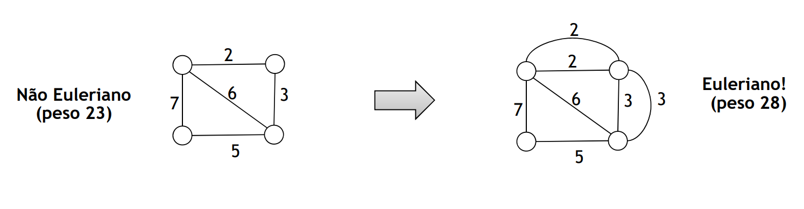 

### Non-Directed Graphs Method

1. Find all nodes with an **odd degree** (this number is always even)

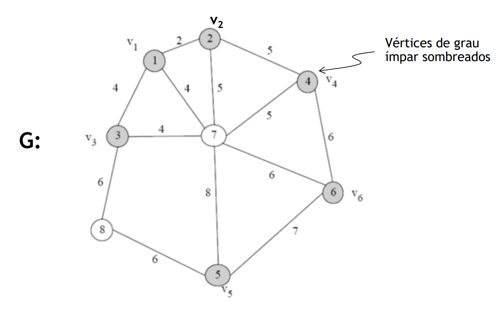 

2. Find all **shortest paths and minimum distances** between all pairs of nodes with odd degree (make a table)

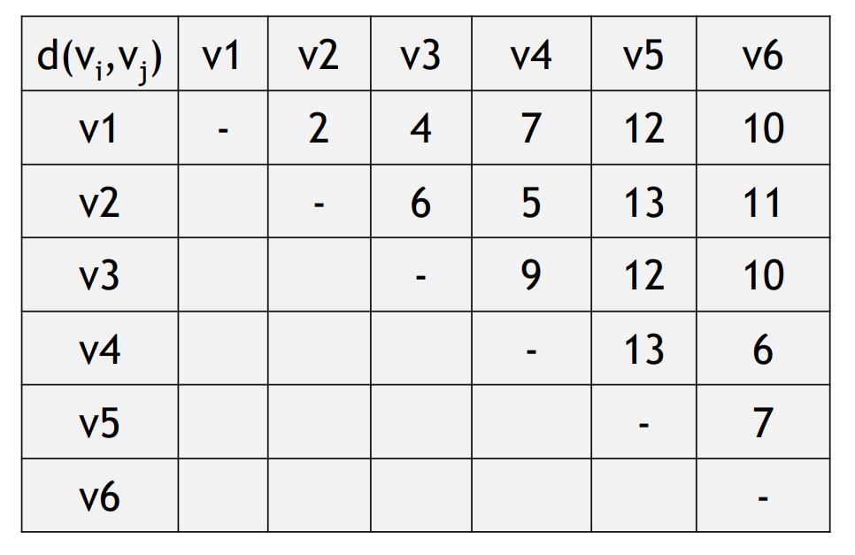 

3. Build a complete graph `G'` using the nodes with an **odd degree** and with edge weight equal to the ones calculated on step 2.
4. Pair nodes of `G'` such that the **sum of distances is minimum**

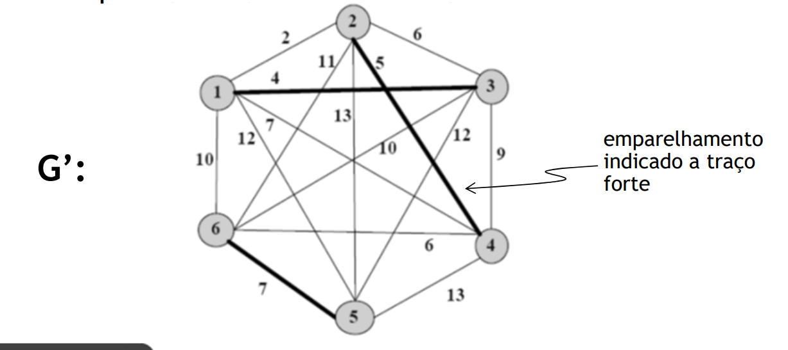 

5. For each pair, **add duplicate edges to `G`**, with shortest path between the two nodes. Let `G*` be the resulting graph
6. Find Euler Circuit in `G*`

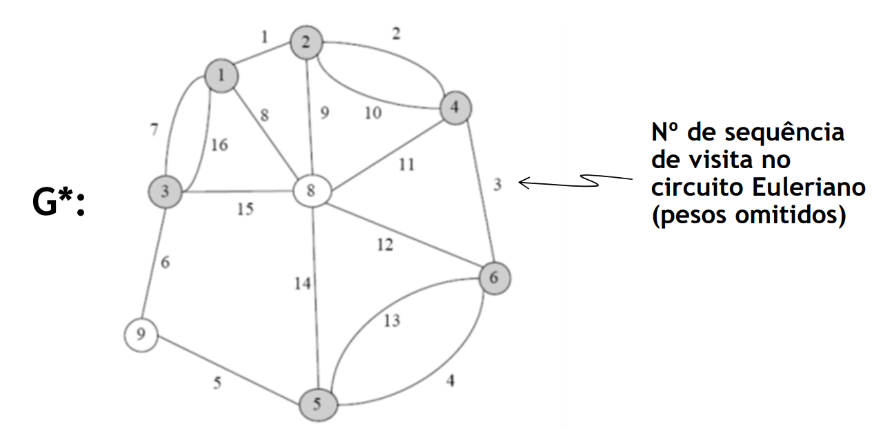 

### Directed Graphs Method

1. For each node, write the number of `(incoming edges - outgoing edges) = diff`

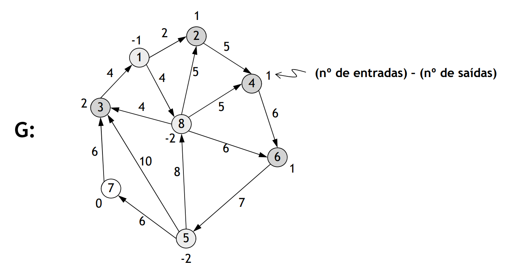 

2. Find the shortest path between nodes with negative diff and nodes with positive diff. Show results in a split graph.

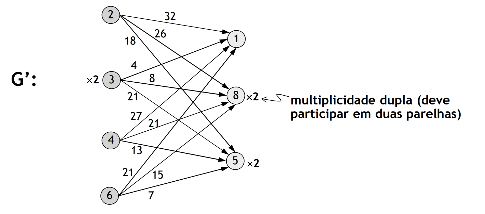 

3. Formulate optimal pairing problem with maximum flow with minimum cost problem and solve.

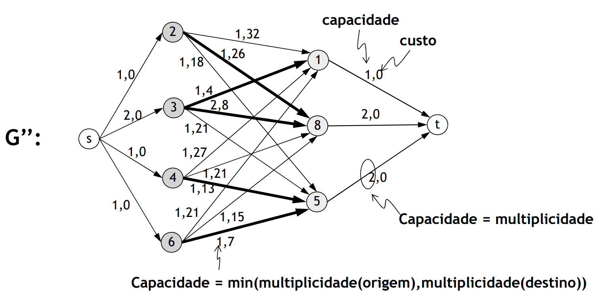 

4. Duplicate in `G` the shortest paths between the paired nodes in `3`, and obtain the Eulerian Circuit.

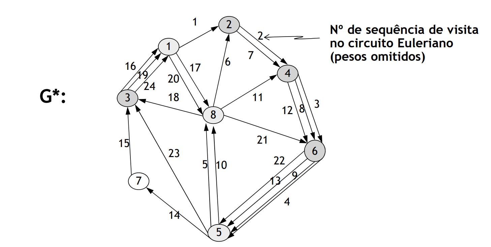 

