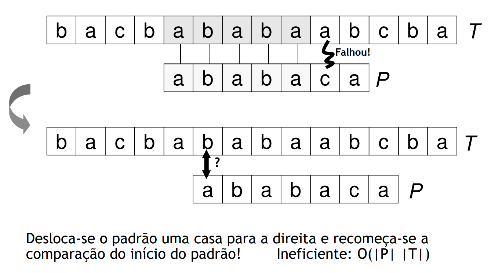
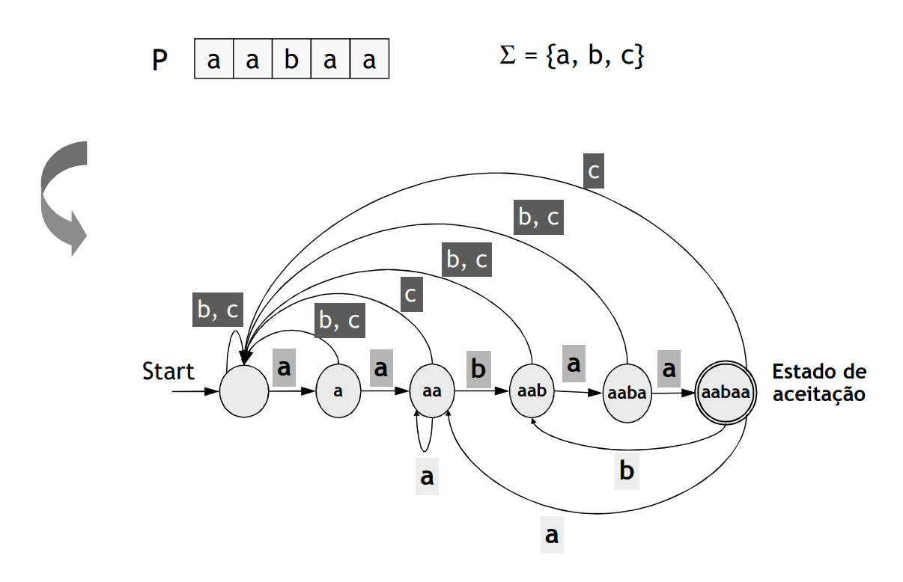
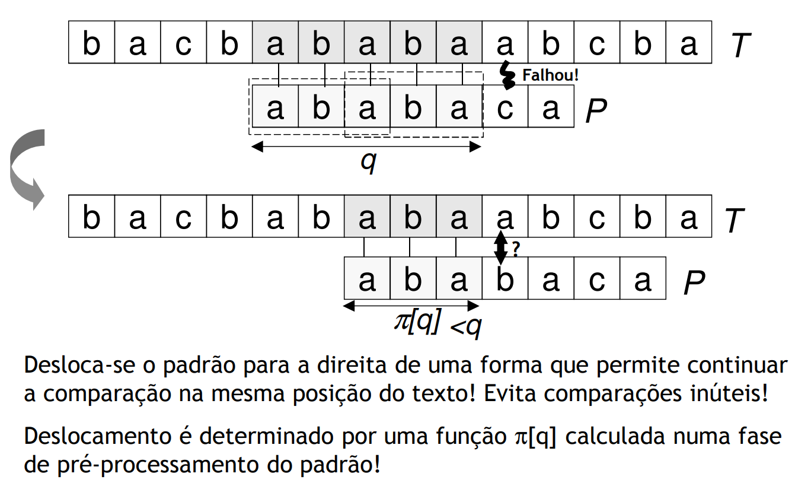
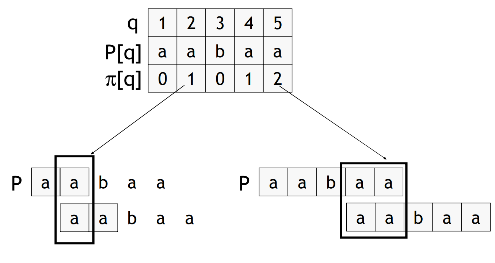
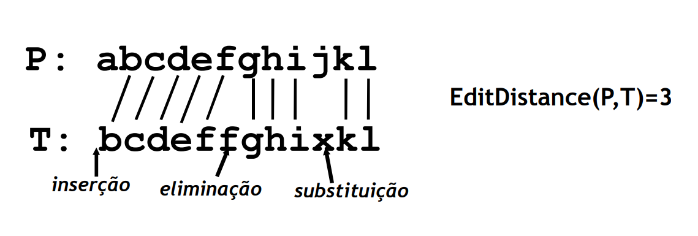

# String Matching and Approximate String Matching

## Problem

 - Find **all occurences** of a pattern `P` in a text `T`, such that:
    - `P` and `T` are strings
    - Occurences are defined by the displacement regarding the beggining of `T`
    - Occurences can be overlapped

<br>

## Algorithms

### **Naive**
- For each displacement, compare from the beggining of the pattern
- Inefficient: `O(|P| * |T|)`

<br>

### **Based in Finite Automata**
- Pre-processment: generate finite automata equal to `P`, can be large ` O(|P| * |Σ|)`, where `Σ` is the alphabet
- Allows to analise `T` in linear time `O(|T|)`

<br>

### **Knuth-Morris-Pratt**
- Pattern pre-processment: linear time `O(|P|)`
- Text processment: linear time `O(|T|)`
- Total Time: `O(|T| + |P|)`

<br>

**Pre-Processment**

<br>

```C++
// Prints occurrences of txt[] in pat[] 
void KMPSearch(char* pat, char* txt) {
    int M = strlen(pat); 
    int N = strlen(txt); 
  
    // create lps[] that will hold the longest prefix suffix 
    // values for pattern 
    int lps[M]; 
  
    // Preprocess the pattern (calculate lps[] array) 
    computeLPSArray(pat, M, lps); 
  
    int i = 0; // index for txt[] 
    int j = 0; // index for pat[] 
    while (i < N) { 
        if (pat[j] == txt[i]) { 
            j++; 
            i++; 
        } 
  
        if (j == M) { 
            printf("Found pattern at index %d ", i - j); 
            j = lps[j - 1]; 
        } 
  
        // mismatch after j matches 
        else if (i < N && pat[j] != txt[i]) { 
            // Do not match lps[0..lps[j-1]] characters, 
            // they will match anyway 
            if (j != 0) 
                j = lps[j - 1]; 
            else
                i = i + 1; 
        } 
    } 
} 
  
// Fills lps[] for given patttern pat[0..M-1] 
void computeLPSArray(char* pat, int M, int* lps) {
    // length of the previous longest prefix suffix 
    int len = 0; 
  
    lps[0] = 0; // lps[0] is always 0 
  
    // the loop calculates lps[i] for i = 1 to M-1 
    int i = 1; 
    while (i < M) { 
        if (pat[i] == pat[len]) { 
            len++; 
            lps[i] = len; 
            i++; 
        } 
        else // (pat[i] != pat[len]) 
        { 
            // This is tricky. Consider the example. 
            // AAACAAAA and i = 7. The idea is similar 
            // to search step. 
            if (len != 0) { 
                len = lps[len - 1]; 
  
                // Also, note that we do not increment 
                // i here 
            } 
            else // if (len == 0) 
            { 
                lps[i] = 0; 
                i++; 
            } 
        } 
    } 
}
```

## Approximate String Matching

- **Input description:** A text string `T` and a pattern string `P`. An edit cost bound `k'.
- **Problem description:** Can we transform `T` to `P` using at most `k`
insertions, deletions, and substitutions?
(Ou: qual é o grau de semelhança entre P e T ?)

### Edit Distance Between 2 Strings

The least number of changes necessary to transform `T` into `P`. These changes can be:
 - **Subsitution**
 - **Insertion**
 - **Elimination**

<br>
