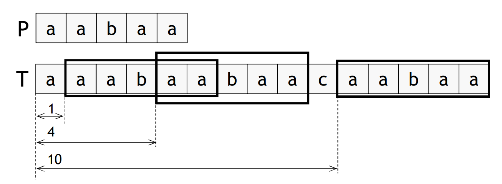

# String Matching and Approximate String Matching

## Problem

 - Find **all occurences** of a pattern `P` in a text `T`, such that:
    - `P` and `T` are strings
    - Occurences are defined by the displacement regarding the beggining of `T`
    - Occurences can be overlapped

 

## Algorithms

 - **Naive**
    - For each displacement, compare from the beggining of the pattern
    - Inefficient: `O(|P| * |T|)`
 - **Based in Finite Automata**
    - Pre-processment: generate finite automota equal to `P`
    - Allows to analise `T` in linear time

