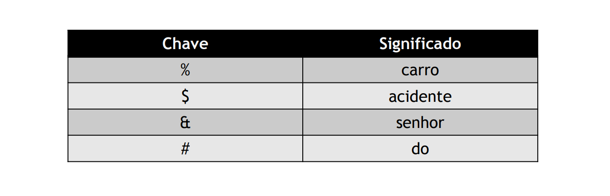

# String/File Compression

## Keyword Encoding

 - **Replace common words** with **special characters** or sequences
 - The words are replaces according to a frequency table

 

## Run-length encoding

 - Typically used when the same pattern or letter shows up many times in a row
 - It's not very common in text, but it is used in images or video
 - **Technique:**
     - special marker `*`
     - character
     - number of times that character shows up
     - **Ex.**
        - `AAAAAAAAAA` → `*A10`
        - `AABBBBBBBBAMMKKKKKKKKKM` → `AA*B8AMM*K9M`

## [Huffman Coding](https://www.youtube.com/watch?v=0kNXhFIEd_w)

### Constant Codification

 - Fixed codification size:
     - if `|alphabet| = C` → code with `log2(C)` bits
 - Possible representation
     - Binary tree with characters in the leaves

